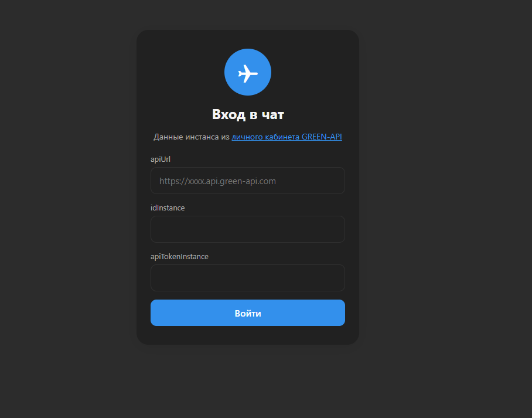
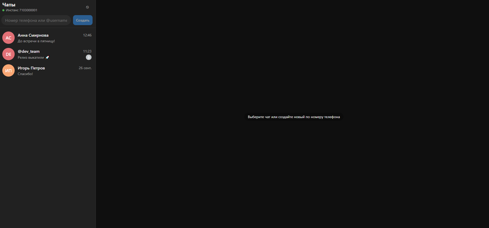
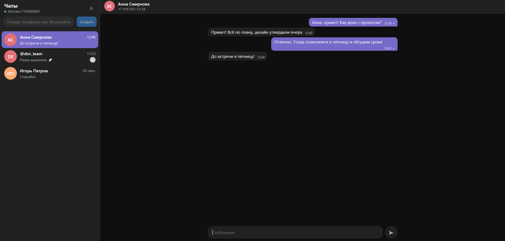
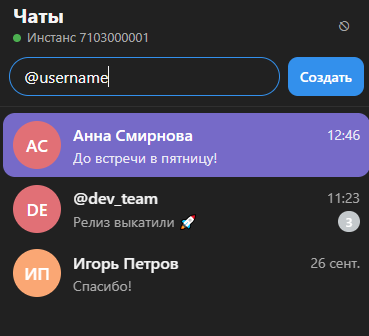
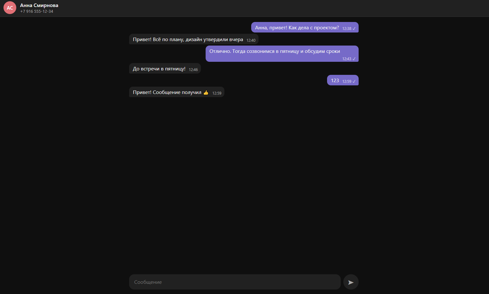
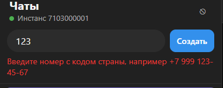
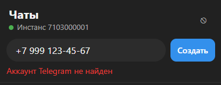
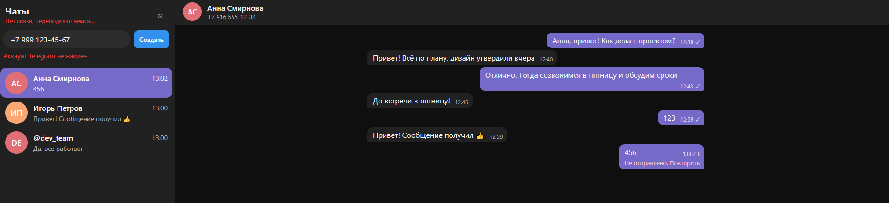

# Чат на GREEN-API

Тестовое задание на позицию React-разработчика. Это простой веб-чат: можно отправлять и получать текстовые сообщения через [GREEN-API](https://green-api.com).

В задании был MAX, но можно было взять WhatsApp или Telegram. Аккаунта в MAX у меня нет, поэтому я сделал чат под Telegram. Нашел, что методы API для MAX и Telegram устроены одинаково, поэтому код подойдёт и для MAX.

Стек: React 19, TypeScript, Vite. 

## Запуск

Локально:

```bash
npm install
npm run dev
```

Приложение откроется на http://localhost:5173.

Через Docker:

```bash
docker compose up -d --build
```

Приложение будет на http://localhost:8090. Остановить: `docker compose down`.

## Как работает

1. На экране входа приложение вызывает `getStateInstance` и пускает дальше, только если инстанс авторизован.
2. Чтобы начать чат, вводится номер телефона или `@username`. Приложение вызывает `CheckAccount` и получает `chatId`. Далее сохраняем айди и по нему понимаем, в какой чат положить входящее сообщение.
3. Отправка идёт через `SendMessage`. Если отправка не удалась, рядом появляется кнопка «Повторить».
4. Входящие сообщения приходят через очередь уведомлений (подробнее ниже). Если пишет новый человек, чат с ним создаётся сам.
5. Чаты и история хранятся в `localStorage`.

## Структура

- `api/greenApi.ts` — запросы к GREEN-API и обработка ошибок.
- `api/types.ts` — типы ответов API, чатов и сообщений.
- `hooks/useNotificationPolling.ts` — цикл получения уведомлений из очереди.
- `hooks/useStoredState.ts` — `useState`, который сохраняет значение в `localStorage` или `sessionStorage` и синхронизирует его между вкладками.
- `components/LoginForm.tsx` — форма входа.
- `components/ChatApp.tsx` — основная логика: список чатов, сообщения, отправка, обработка входящих.
- `components/Sidebar.tsx` — левая колонка со списком чатов и статусом соединения.
- `components/NewChatForm.tsx` — создание чата по номеру или username.
- `components/ChatWindow.tsx`, `MessageList.tsx`, `MessageInput.tsx` — окно чата, лента сообщений и поле ввода.
- `components/Avatar.tsx` — кружок с инициалами.
- `utils/` — нормализация номера телефона, разбор уведомлений, форматирование времени.

## Принятые решения

**Очередь вместо webhook.** Webhook требует сервера с публичным адресом, а приложение работает только в браузере. Поэтому уведомления я забираю сам: запрашиваю `ReceiveNotification`, обрабатываю и удаляю через `DeleteNotification`. Запрос висит до 20 секунд, пока не придёт что-то новое.

**Удаляю все уведомления, даже ненужные.** Очередь отдаёт первое уведомление, пока его не удалят. Если пропустить, например, статус доставки и не удалить его, очередь на нём застрянет.

**Повторные уведомления.** Если удаление не прошло (например, пропала сеть), то же уведомление придёт снова. Сообщения проверяются по `idMessage`, поэтому дублей в чате не будет.

**Одна вкладка читает очередь.** Очередь общая. Если открыть приложение в двух вкладках и читать из обеих, сообщения разойдутся между ними. Поэтому очередь читает только одна вкладка (через `navigator.locks`), а остальные получают сообщения через `localStorage`.

**Ошибки.** При проблемах с сетью запрос повторяется через 1, 2, потом 5 секунд. Если токен стал неверным (401/403), приложение возвращает на экран входа. Если закончился лимит тарифа (466), опрос останавливается.

**Хранение данных.** Бэкенда нет, поэтому токен хранится в storage. Я держу его в `sessionStorage`, чтобы он удалялся при закрытии вкладки. Историю храню в `localStorage`, до 200 последних сообщений на чат, чтобы не упереться в лимит хранилища. Сама история очищается при выходе из приложения.


## Скриншоты

Скриншоты сделаны на тестовых данных.

### Форма входа



### Список чатов



### Открытый чат



### Создание чата по номеру или username



### Отправка сообщения и ответ собеседника



### Ошибка: неверный номер



### Ошибка: аккаунт не найден



### Ошибка: нет связи и сообщение не отправлено

